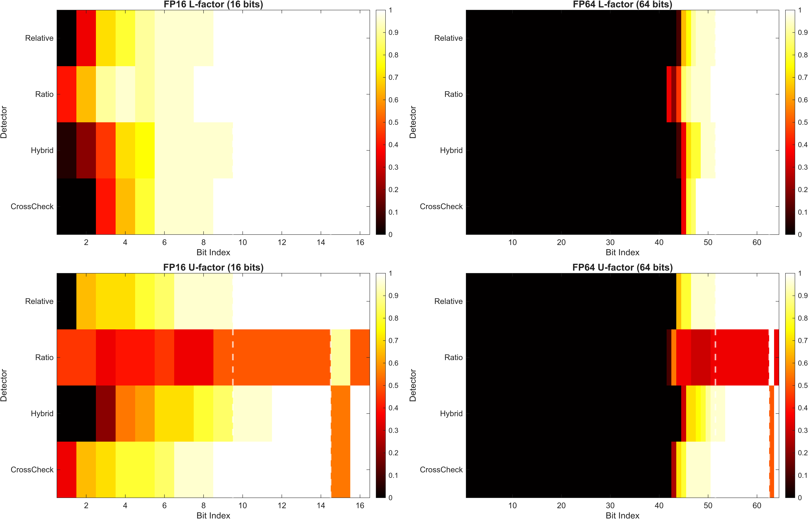

# Exploiting Mixed-Precision Redundancy for Soft-Error Detection in LU Decomposition

[](https://link.springer.com/journal/11227)
[](LICENSE)
[](https://www.mathworks.com/products/matlab.html)


### FP16 vs FP64 Bit Sensitivity Comparison



This figure presents a **bit-level vulnerability analysis** comparing floating-point fault detection across FP16 (16-bit) and FP64 (64-bit) formats for both L-factor and U-factor matrices in LU decomposition. Each heatmap shows the **True Positive Rate (TPR)** of different error detectors for single-bit flips at specific bit positions.


**Implementation and experimental code for the paper:**

> **Nima Sahraneshinsamani**, Sandra Catalán, José R. Herrero  
> *Exploiting Mixed-Precision Redundancy for Soft-Error Detection in LU Decomposition*  
> The Journal of Supercomputing (submitted), 2025

## 📄 Paper Information

- **Status**: Submitted to The Journal of Supercomputing
- **Preprint**: [Link when available]
- **DOI**: [Will be added upon publication]

## 🎯 Overview

This repository contains the MATLAB implementation for evaluating **Algorithm-Based Fault Tolerance (ABFT)** methods in mixed-precision LU decomposition under soft errors (bit-level faults).

### Key Contributions

1. **Novel ABFT detectors** exploiting FP16/FP64 redundancy
2. **Comprehensive bit-level analysis** (all 64 bits of FP64)
3. **Panel-based LU factorization** with fault injection framework
4. **Statistical evaluation** with confidence intervals

### Detectors Evaluated

- **Relative**: Checksum-based relative error
- **Ratio**: First/second-order error ratio
- **Hybrid**: Combined ratio + relative with adaptive thresholds
- **CrossCheck**: L/U factor cross-validation

## 🚀 Quick Start

### Run Default Experiment

```matlab
% Clone and run
git clone https://github.com/yourusername/MPF_ABFT.git
cd MPF_ABFT
MPF_ABFT
